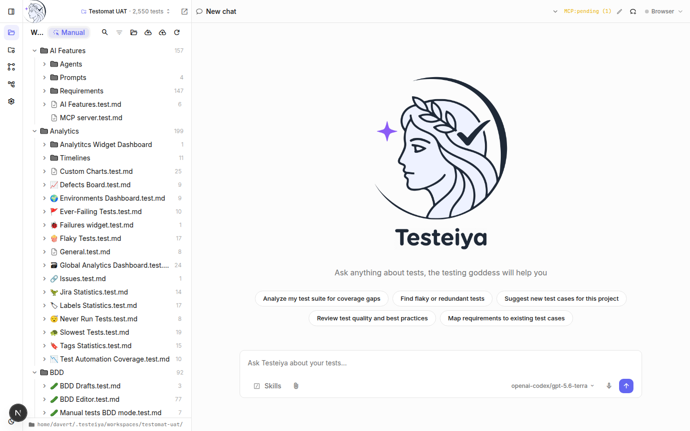

# Testeiya App

**Testeiya** is an AI assistant for QA. Chat with it to analyze your test suites, find coverage gaps, review test quality, and create or improve test cases — across your Testomat.io projects or any local folder.

It runs as a **desktop app** (Windows, macOS, Linux) and as a **web app** from the same codebase.



## Two repos: the App and the Agent

Testeiya is split into two repositories:

| | Repo | What it is |
|---|---|---|
| **Testeiya App** | this repo (`testomatio/testeiya-app`) | The chat UI and the desktop/web shell — what you see and click. |
| **Testeiya Agent** | [`testomatio/testclaw`](https://github.com/testomatio/testclaw) | The agent brain (LLM, MCP servers, QA skills). Lives here as the `testeiya/` **git submodule**. |

> **Internal note:** **TestClaw** is the Agent's working codename — for internal use only. **Never use "TestClaw" in anything public.** Publicly the product is **Testeiya** (App + Agent).

The App can't run without the Agent, so the steps below pull both for you.

## Quick start

Four steps to a running app. No deep technical knowledge needed — just copy each command.

### 1. Install the tools

- [Bun](https://bun.sh) 1.3.5 or newer
- [Git](https://git-scm.com)

That's all — Bun is the only runtime you need.

### 2. Get the code

Clone with `--recursive` so the Agent comes along:

```bash
git clone --recursive git@github.com:testomatio/testeiya-app.git
cd testeiya-app
```

*(Forgot `--recursive`? `bun install` in the next step pulls the Agent for you.)*

### 3. Install

```bash
bun install                       # also fetches the Agent (submodule) automatically
cd testeiya && bun install && cd ..
```

### 4. Start the app

Start with the **web app** — fastest to launch and it hot-reloads as you edit:

```bash
bun run dev              # open http://localhost:3050
```

Or run the **desktop app** (a native window):

```bash
bun run desktop:dev
```

On first launch, open **Settings (⚙️)** and paste your AI provider key — Testeiya works with OpenAI, Anthropic, OpenRouter, and more. Then start chatting about your tests.

## Web app vs desktop app

Same UI either way — the difference is how Testeiya reaches your files:

- **Desktop app** — has **native filesystem access**. Use the in-app **Open folder** dialog to point Testeiya at any directory; it reads and writes files directly. Best for working against a local repo.
- **Web app** — runs in a browser, so there's **no native folder picker**. Give it a folder up front via the `TESTEIYA_WORKSPACE` setting (see below), or connect a Testomat.io project from the UI (which creates its own workspace).

## Run modes

### Web app — fast dev loop (start here)

```bash
bun run dev
```

Starts the UI with hot reload at **http://localhost:3050** plus the Agent server (`:3210`). Edit the UI and the browser refreshes instantly. `/api/*` is proxied to the Agent server and the chat WebSocket connects to it directly.

### Desktop app

```bash
bun run desktop:dev      # build the static UI + launch the native window
```

Build distributable installers (DMG / Setup.exe / AppImage etc.):

```bash
bun run desktop:build    # artifacts land in build/
```

### Serve the built web app (no Electrobun)

```bash
bun run build                       # static export → out/
cd testeiya && bun run serve:app    # serve out/ + API + WS on one port
```

## Configure with `.env`

Everything can be set in the app's **Settings**, but you can also preconfigure via a `.env` file in the project root (or `~/.testeiya/.env` for a packaged app). All keys are optional — set only what you need:

```bash
# Testomat.io API key — OPTIONAL; you can connect Testomat.io in the app
# instead. Lets Testeiya pull/push your tests.
TESTOMATIO=your-testomatio-api-key

# Testomat.io backend URL (defaults to https://app.testomat.io).
# For our staging environment, point it at beta:
#   TESTOMATIO_URL=https://beta.testomat.io
TESTOMATIO_URL=https://app.testomat.io

# AI provider key — OPTIONAL, you can set this in Settings instead.
# The variable name matches your provider: OPENROUTER_API_KEY, OPENAI_API_KEY, ANTHROPIC_API_KEY, ...
OPENROUTER_API_KEY=sk-or-...

# Web app only: the folder Testeiya opens as the workspace on startup
TESTEIYA_WORKSPACE=/path/to/your/tests
```

See [All environment variables](#all-environment-variables) for the full list.

## Using the app

- **Chat** with the agent — it streams responses, shows its reasoning, and runs tools.
- **Questions:** when the agent asks something, click an option or type a reply to continue.
- **⚙️ Settings:** set your provider API key, toggle **MCP servers** on/off for the session, and **open a local folder** as the workspace.
- **Workspace:** on desktop, the folder button in the header opens any directory (native picker) so the agent works from it; the tree icon toggles the file sidebar, where you can open and edit files.
- **Theme:** the sun/moon button switches light/dark (synced across the whole UI, including the editor); the choice is remembered.

## How it works

One Bun server (`testeiya/src/app-server.ts`, from the Agent submodule) is the whole backend — it serves the UI, the HTTP API, and the agent WebSocket on a single origin:

```
┌─────────────────────────── Bun app-server (one origin) ───────────────────────────┐
│  static UI (out/)   ·   HTTP API (/api/*)   ·   agent WebSocket (chat streaming)    │
│                                   │                                                 │
│              pi-coding-agent  +  MCP servers  +  QA skills                          │
└─────────────────────────────────────────────────────────────────────────────────┘
```

- **Desktop:** an Electrobun window points at the server running on a local port.
- **Web:** the same UI in a browser (or embedded as an iframe in Testomat.io).

### Updating the Agent

The Agent (`testeiya/` submodule) ships fixes, new skills, and model updates on its own schedule. **Run this regularly to keep your Agent current:**

```bash
bun run update:agent
```

It pulls the latest Agent from [`testomatio/testclaw`](https://github.com/testomatio/testclaw) (`master`) and refreshes its dependencies. Make a habit of running it — at least whenever you `git pull` the App.

To pin the App to the updated Agent for everyone else, commit the bumped pointer:

```bash
git add testeiya && git commit -m "chore: bump Testeiya Agent"
```

## Workspaces and projects

A **workspace** is a folder on disk; a **project** is a Testomat.io project. A workspace represents a project's manual tests as `*.test.md` files. There are two ways to get one:

- **Open a project** — connect Testomat.io, pick a project, and Testeiya creates a dedicated folder for it (`~/.testeiya/workspaces/<project>/`), pulls the manual tests into it, and switches there. Switching projects switches folders.
- **Open a folder** — point Testeiya at any directory. If ~all of its files are `*.test.md` it's treated as a manual-tests project (tests at the root). Otherwise Testeiya keeps a gitignored cache at `.testeiya/manual-tests/` and shows it in the sidebar; the rest of the repo shows as folders with only `*.test.md` files visible.

The **Workspace** panel has **Pull** and **Push** buttons that run [`check-tests`](https://github.com/testomatio/check-tests) for the workspace's manual tests — pull to refresh from Testomat.io, push to upload local edits. The project token comes from your connected account (or the `TESTOMATIO` key from your `.env`).

## Starting a session from Testomat.io projects

Pull tests from one or more Testomat.io projects into a workspace and open a pre-configured session:

```bash
curl -X POST http://localhost:3050/api/agent/start \
  -H "Content-Type: application/json" \
  -d '{
    "projects": [
      { "title": "Frontend App", "slug": "frontend", "token": "your-testomatio-token" },
      { "title": "API Server", "slug": "api", "token": "another-token" }
    ]
  }'
# → { "sessionId": "a1b2c3d4-...", "projects": [ ... ] }
```

Then open `http://localhost:3050/?session=a1b2c3d4-...`. During start, a temp workspace is created, `check-tests` pulls each project's `*.test.md` files into it, an MCP server is configured per project, and the agent's system prompt is extended with that context.

Session info:

```bash
curl http://localhost:3050/api/agent/<sessionId>
```

## Configuration

### All environment variables

| Variable | Description | Default |
|----------|-------------|---------|
| `TESTOMATIO` | Testomat.io API key (pull/push tests) | — (or connect Testomat.io in the app) |
| `TESTOMATIO_URL` | Testomat.io backend for pulling tests (staging: `https://beta.testomat.io`) | `https://app.testomat.io` |
| `<PROVIDER>_API_KEY` | Your LLM provider key — name matches the provider (e.g. `OPENROUTER_API_KEY`, `OPENAI_API_KEY`) | — (or set via Settings) |
| `TESTEIYA_WORKSPACE` | Web mode: folder opened automatically as the workspace on cold load | — |
| `PORT` | Port for the Bun app-server (desktop uses a random free port) | `3050` |
| `AGENT_SERVER_URL` | Where `next dev` proxies `/api/*` (web mode) | `http://localhost:3210` |
| `NEXT_PUBLIC_TESTEIYA_WS_URL` | Agent WebSocket URL — **dev only**; the production/desktop build always uses same-origin | `ws://localhost:3210` |

### LLM provider

Choose your provider and model in the app's **Settings**, or set defaults in `testeiya/testeiya.config.json` (or `~/.testeiya/config.json`):

```json
{
  "provider": {
    "name": "openrouter",
    "baseUrl": "https://openrouter.ai/api/v1",
    "model": "anthropic/claude-sonnet-4",
    "contextWindow": 200000,
    "maxTokens": 16384
  }
}
```

### Where state is stored

| Path | Contents |
|------|----------|
| `~/.testeiya/sessions.json` | Active sessions (24h TTL) |
| `~/.testeiya/auth.json` | Provider API key (set via Settings) |
| `~/.testeiya/config.json` | Optional provider/permissions overrides |
| `~/.testeiya/workspaces/<project>/` | Persistent per-project workspace: pulled `*.test.md` + `.testeiya/` (MCP + project link) |
| `<tmp>/testeiya-<id>/` | Ephemeral multi-project import workspace (removed on session expiry) |

## Tech stack

- **Next.js 16** (App Router, static export) + **Tailwind CSS v4** + **shadcn/ui / AI Elements**
- **Bun** server (`Bun.serve` for UI + API + WebSocket)
- **Electrobun** for the cross-platform desktop shell
- **pi-coding-agent** SDK (the Agent), **@testomatio/mcp** (MCP), **@testomatio/skills** (QA skills), **check-tests** (Testomat.io sync)

## Ports

Use 3050+ for dev servers — never 3000. Web dev: UI `3050`, agent server `3210`. The desktop app picks a random free port.
