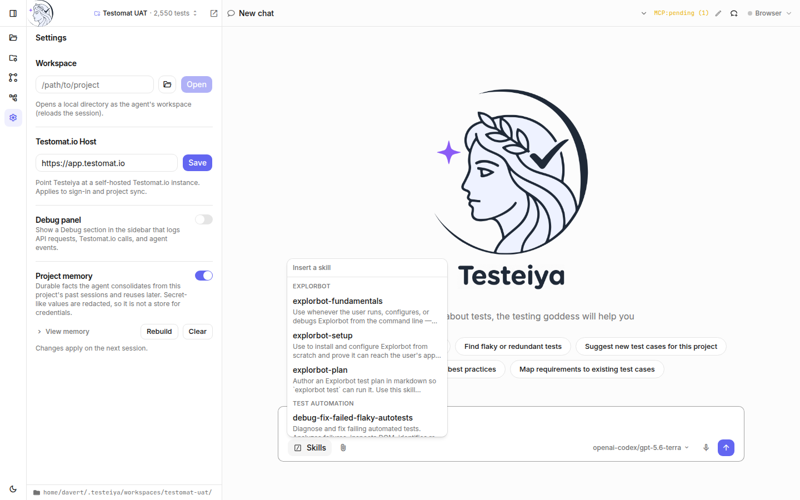
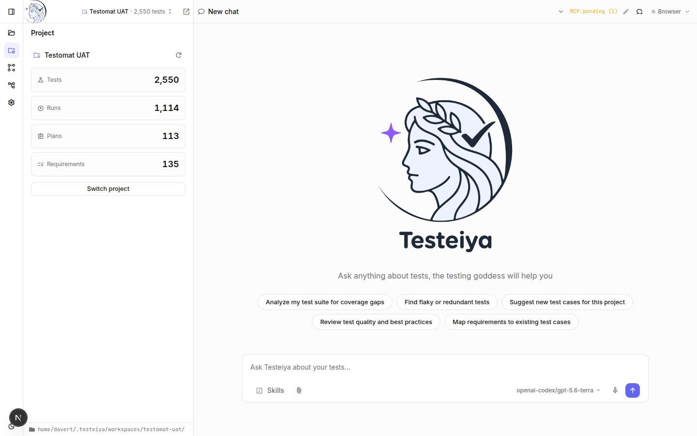
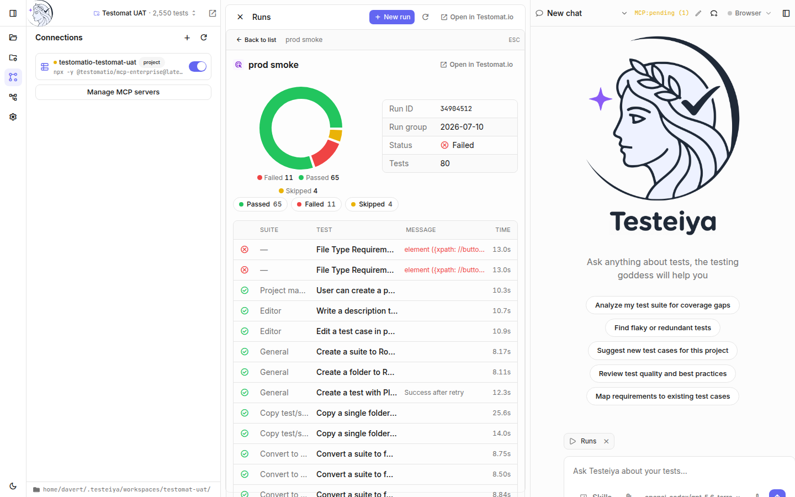
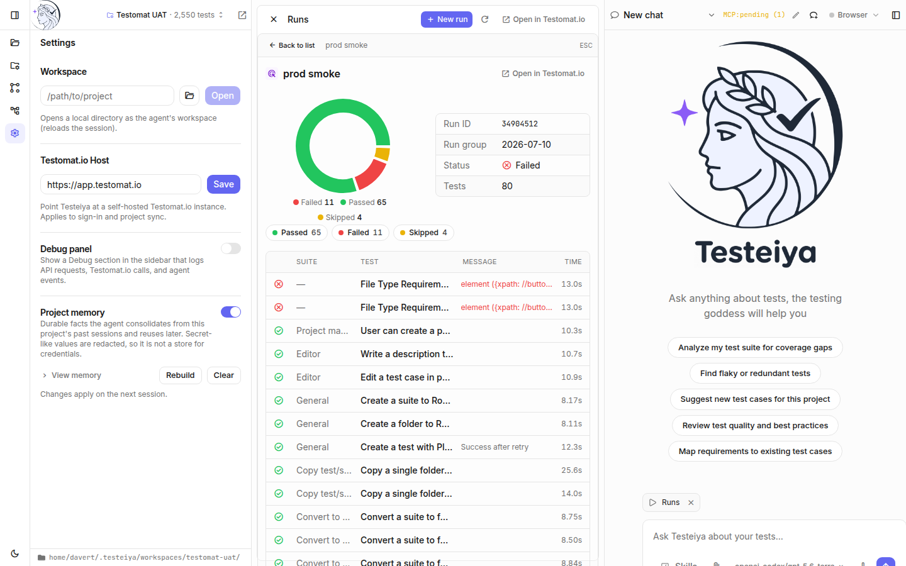
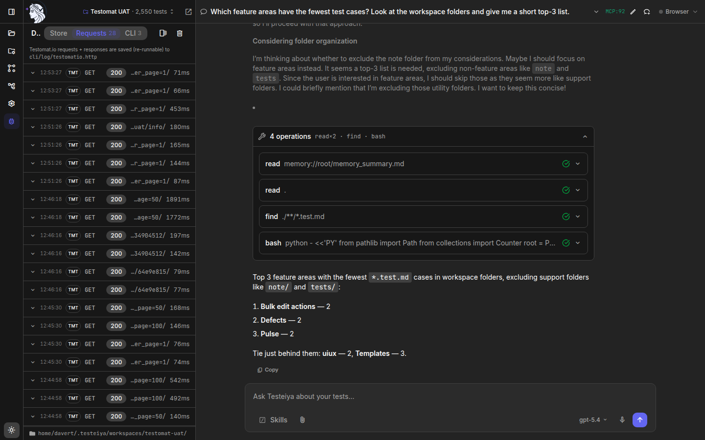
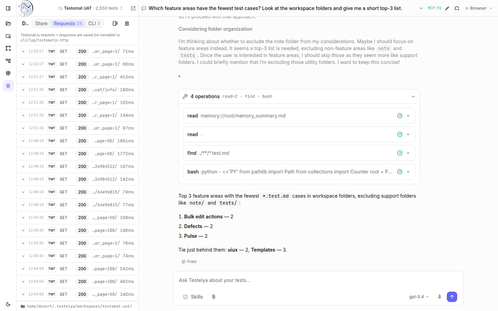
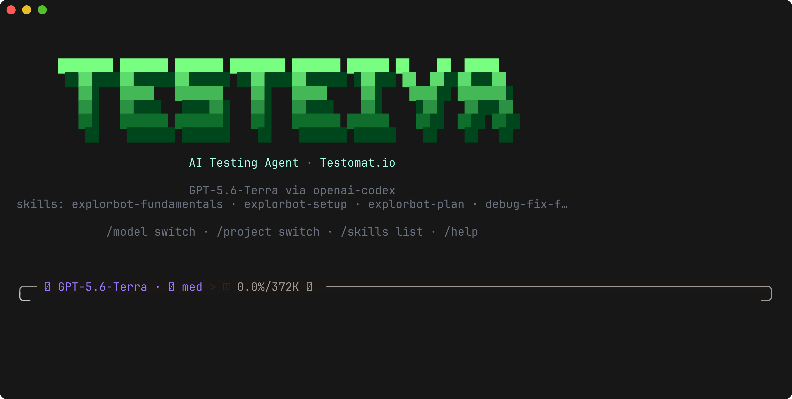
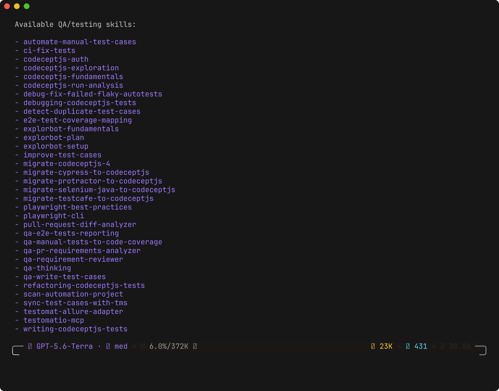

# Application overview

Testeiya is an AI-powered QA assistant. One agent brain ships in three surfaces:

| Surface | What it is | Best for |
|---|---|---|
| **Desktop** | A native window (Windows, macOS, Linux) with native filesystem access — open any folder and the agent reads and writes files directly. | Working against local repos on your machine. |
| **Web** | The same UI in a browser, servable standalone or embedded in Testomat.io. | Hosted setups and fast dev loops. |
| **CLI** | A terminal agent (`testeiya`) with no GUI — the same brain, running in your current directory. | Terminal work, CI, quick one-off analysis. |

Desktop and web share the exact same interface and backend, so everything below applies to both. The [CLI](#the-cli) is covered at the end.

The window has three zones:

- the **sidebar** on the left — an icon strip that opens the Workspace, Project, Connections, Pipelines, Settings, and Debug sections;
- the **chat** — where you talk to the agent;
- the **widget pane** — opens in the middle when you browse project data or edit a file.

## Chat

Chat is the primary way to work with Testeiya. Ask about your tests in plain language; the agent plans, runs tools, and answers.

While the agent works you see:

- **Reasoning** — the model's thinking, streamed live in collapsible sections.
- **Tool calls** — every file read, search, shell command, and Testomat.io query, grouped into a compact block you can expand. Each call shows its input and result, so you can verify where an answer came from.
- **Plans** — for multi-step work the agent maintains a todo list in a persistent panel that updates as it progresses.
- **Questions** — when the agent needs a decision it asks in-chat; click an option or type a reply to continue.
- **Status bar** — the current activity with a **Stop** button to abort a turn.

Answers render as full markdown — tables, code blocks, mermaid diagrams — with a **Copy** action.

### Chat history

The chat title in the header is a dropdown of previous conversations. Switch between them, rename the current chat (pencil icon), or start a fresh one (**New chat**). Conversations are tied to the workspace's session.

### The prompt box

The prompt box does more than take text:

- **Skills** — insert any of the bundled or custom QA skills as a `/skill-name` mention. The menu groups skills by category and is searchable.
- **Attachments** (paperclip) — attach files or images to a prompt; paste screenshots directly.
- **File mentions** — type `@` to mention a workspace file; the agent gets it as context.
- **Model selector** — the current provider/model; click to change it.
- **Voice input** (microphone) — dictate your prompt; speech is transcribed into the box. Requires a connected Testomat.io project.

### Widgets as context

When a data widget (tests, runs, a file) is open, a context chip appears above the prompt box. The agent sees what you see — ask "why did this run fail?" while a run is open and it knows which run you mean. Remove the chip to drop the context.

### The agent's browser

The **Browser** indicator in the header shows whether the agent's managed browser is running. The agent uses it to open web pages and verify behavior during exploratory tasks; you can start/stop it and grab a screenshot of what the agent currently sees.

## Workspace

A **workspace** is the folder the agent works in. The Workspace section shows its file tree:

- Open **any local folder** (native picker on desktop) — if it's a code repo, manual tests live in a gitignored `.testeiya/manual-tests/` overlay; if the folder contains (almost) only `*.test.md` files, the folder itself is the test project.
- **Manual** badge and per-folder counts show where test cases live.
- **Search** the workspace, filter to changed files, or refresh the tree.
- **Pull / Push** sync manual tests with Testomat.io — see [Test management](../workflows/test-management.md).

Click any `*.test.md` file to open it in the **test editor** — a block editor that understands the Testomat.io markdown format (suites, test cases, IDs, priorities, tags), with a raw-markdown toggle:

## Project

The Project section shows the Testomat.io project the session is connected to, with live counts:

Each tile opens a browsable table in the widget pane — no prompt required:

- **Tests** — the full test inventory with suite, state, priority, and tag filters.
- **Runs** — run history with status and progress; click a run for details.
- **Plans** and **Requirements** — the project's plans and requirement coverage.

Tables support filters and column settings, and every item links back to Testomat.io (**Open in Testomat.io**). **Switch project** changes the connected project — each project gets its own persistent workspace, so switching is instant and nothing is lost.

## Connections

The Connections section lists the MCP servers available to the agent. Connecting a Testomat.io project automatically adds a project-scoped server (live access to tests, runs, plans). Toggle servers on or off per session, or **Manage MCP servers** to add your own.

## Providers and models

Click the model name in the prompt box to open **Providers & Models**:

- **Subscriptions** — sign in with accounts you already have: Anthropic (Claude Pro/Max), ChatGPT Plus/Pro (Codex), GitHub Copilot, Cursor, GitLab Duo, and more.
- **API keys** — OpenAI, Anthropic, OpenRouter, or any OpenAI-compatible endpoint.
- **Thinking** — set the reasoning effort for reasoning-capable models.

Changes apply when a new session starts.

## Settings

- **Workspace** — open a local directory as the agent's workspace.
- **Testomat.io host** — point Testeiya at a self-hosted Testomat.io instance.
- **Debug panel** — reveal the Debug sidebar section (see [Debugging](../development/debugging.md)).
- **Project memory** — durable facts the agent consolidates from past sessions on this project and reuses later. View, rebuild, or clear it. Secret-like values are redacted.

Everything here can also be preconfigured with a `.env` file — see [Build the app locally](../development/building-locally.md#configure-with-env).

## Skills

Skills are packaged QA expertise the agent applies to your tasks. Testeiya bundles 30+ skills in six categories:

| Category | Skills |
|---|---|
| **Test Management** | write test cases, improve test cases, detect duplicates, review requirements, QA thinking, PR analysis, coverage mapping, TMS sync, Testomat.io MCP |
| **Test Automation** | automate manual test cases, debug and fix failing/flaky autotests, Allure adapter |
| **CodeceptJS** | fundamentals, writing tests, debugging, refactoring, run analysis, migrations from Cypress/Protractor/Selenium/TestCafe |
| **Explorbot** | exploratory-testing setup, planning, fundamentals |
| **Playwright** | playwright-cli browser driving, Playwright best practices |

The agent picks skills automatically when they match your request, or you can invoke one explicitly from the **Skills** menu. Add your own by dropping a folder with a `SKILL.md` into `~/.testeiya/skills/` (all sessions) or `<workspace>/.testeiya/skills/` (one project) — custom skills appear in the menu with a badge and can override bundled ones by reusing their name.

## Themes

The sun/moon button at the bottom of the icon strip switches light and dark. The choice is remembered and syncs across the whole UI, including the editor. When embedded in Testomat.io, Testeiya follows the host theme.

## Debug panel

A hidden-by-default sidebar section for troubleshooting: live Testomat.io API requests with latencies, agent events, the client store, and CLI console output. Enable it in **Settings → Debug panel**. It's the entry point to Testeiya's full debugging toolkit — see [Debugging Testeiya](../development/debugging.md).

## Pipelines

CI/CD pipeline integration is coming soon; the section is a placeholder today.

## The CLI

The `testeiya` CLI is the same agent in your terminal. It runs in the current directory, loads the same skills, and connects to the same providers:

- QA-focused system prompt tuned for test analysis
- Read-permissive, write-restricted permission model — safe bash commands are auto-allowed, destructive ones are blocked
- Markdown-rendered output, multi-line paste support
- `/model switch`, `/project switch`, `/skills list`, `/help`
- Status bar with model, reasoning effort, context usage, and token counts

Install with `npm install -g testeiya` (requires [Bun](https://bun.sh)), export a provider key, and run `testeiya` in any project. Configuration lives in `testeiya.config.json` or `~/.testeiya/config.json`.

## Where state is stored

| Path | Contents |
|---|---|
| `~/.testeiya/auth.json` | Provider credentials (set via Settings) |
| `~/.testeiya/config.json` | Optional provider/permissions overrides |
| `~/.testeiya/workspaces/<project>/` | Per-project workspace: pulled `*.test.md` files + project link |
| `~/.testeiya/skills/` | Your global custom skills |
| `~/.testeiya/sessions.json` | Active sessions (24-hour TTL) |
