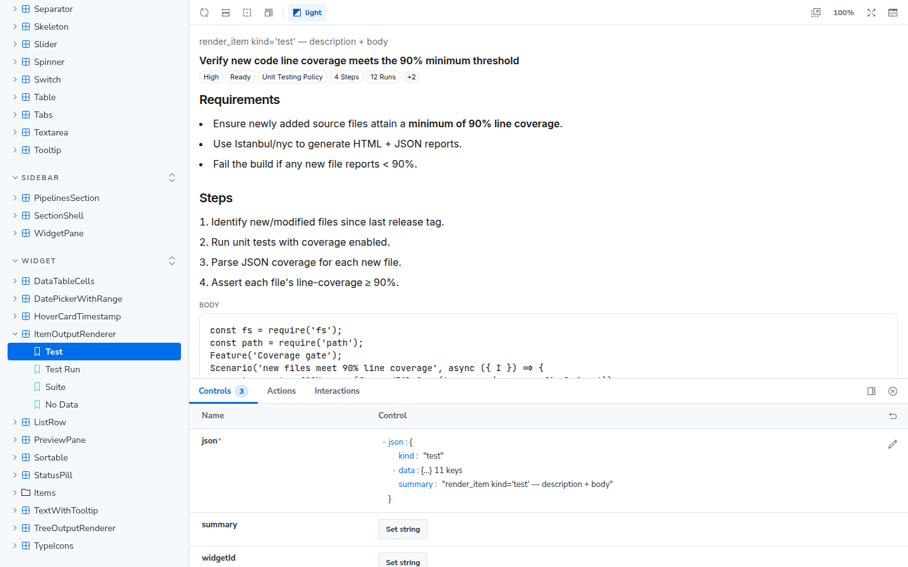

# Storybook

Every presentational component in Testeiya has a story. Storybook is the fastest way to browse the UI kit, develop a component in isolation, and check both themes without clicking through the app.

```bash
bun run storybook        # → http://localhost:6006
```



Storybook is dev-only — it never ships in the web export or the desktop bundle. When the Debug panel is enabled, its header has an **Open Storybook** button as a shortcut.

## How stories are organized

Stories live centrally in `stories/<category>/*.stories.tsx` (not co-located with components), titled `"<Category>/<Component>"`:

| Category | What's in it |
|---|---|
| **Global** | `components/ui/*` primitives, design tokens, icons |
| **Sidebar** | Panel shells and sections |
| **Widget** | Status pills, item renderers, data-table cells — fixtures come from `stories/fixtures.ts` |
| **Agent** | Chat/ai-elements and agent output renderers |

Each variant or state is one named story (`Primary`, `Sizes`, `Streaming`, …). The toolbar has a light/dark theme toggle wired to the app's real theme classes, so components render exactly as they do in the app.

## Writing a story

1. Create `stories/<category>/<component>.stories.tsx` with the title `"<Category>/<Component>"`.
2. Export one named story per state; take fixture data from `stories/fixtures.ts` rather than inventing shapes.
3. Check both themes with the toolbar toggle.

Two rules keep the build healthy:

- **Presentational components only.** Components that need MobX services or app providers are not storied — there is no provider mocking.
- **Story files are typechecked by the app build** (`bun run typecheck` and `next build`), so a broken story breaks the app. Don't import the tsconfig-excluded `components/ai-elements/*` files from stories.

## What's next

- [Build the app locally](building-locally.md)
- [Debugging Testeiya](debugging.md)
