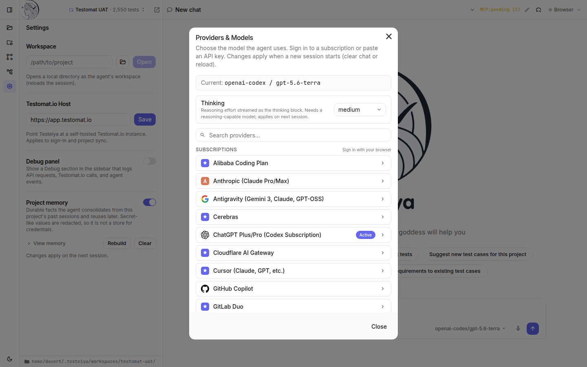
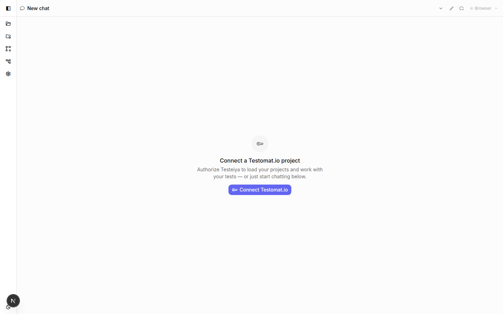
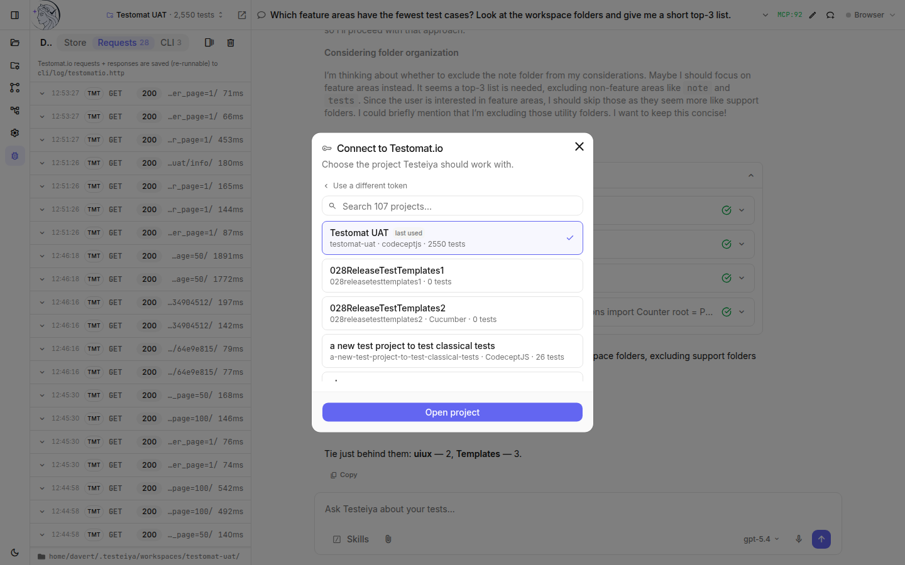
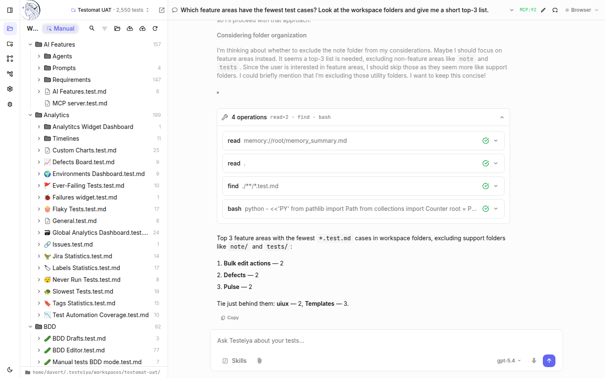

# Quickstart

Get Testeiya running and ask it the first question about your tests. This takes about five minutes.

## Install

Pick the surface that fits how you work. All three share the same agent brain — you can switch later without losing anything.

### Desktop app (recommended)

Download the installer for your platform from the [GitHub Releases](https://github.com/testomatio/testeiya-app/releases) page:

- **macOS** — `.dmg`
- **Windows** — Setup `.zip`
- **Linux** — self-extracting `-Setup.tar.gz`

> [!NOTE]
> Builds are unsigned. Expect a Gatekeeper (macOS) or SmartScreen (Windows) warning on first launch.

### CLI

Install the terminal agent from npm. It requires [Bun](https://bun.sh) on your `PATH`:

```bash
npm install -g testeiya
testeiya          # runs in the current directory
```

### Web app (from source)

Clone and run the repo — see [Build the app locally](development/building-locally.md). The web app is the same UI as the desktop app, served in your browser.

## Set up an AI provider

Testeiya needs an LLM to work. On first launch, open the model selector at the bottom right of the prompt box (or **Settings**) and choose a provider:

- **Sign in with a subscription** you already pay for — Anthropic (Claude Pro/Max), ChatGPT Plus/Pro (Codex), GitHub Copilot, Cursor, and more. Testeiya opens your browser to authorize.
- **Paste an API key** — OpenAI, Anthropic, OpenRouter, or any OpenAI-compatible endpoint.



For the CLI, export the key that matches your provider before starting:

```bash
export OPENROUTER_API_KEY=sk-or-...
testeiya
```

## Connect a project — or open a folder

On a fresh start, Testeiya offers to connect your Testomat.io account:



Click **Connect Testomat.io**, authorize, and pick a project. Testeiya pulls the project's manual tests into a local workspace and connects a project-scoped MCP server, so the agent can read live project data — tests, runs, plans, and requirements.



You don't need a Testomat.io account to use Testeiya. Open any local folder instead (the folder button in the workspace panel, or **Settings → Workspace**) and the agent works with the files it finds there — test files, source code, or both.

## Ask your first question

Type a question, or click one of the suggestions on the start screen:

- *Analyze my test suite for coverage gaps*
- *Find flaky or redundant tests*
- *Suggest new test cases for this project*

The agent streams its reasoning, runs tools against your workspace and project, and answers with sources you can verify:



## What's next

- [Application overview](application/overview.md) — a tour of everything in the app.
- [Test management](workflows/test-management.md) — keep test cases in sync with Testomat.io.
- [Manual testing](workflows/manual-testing.md) — generate and improve test cases with the built-in QA skills.
