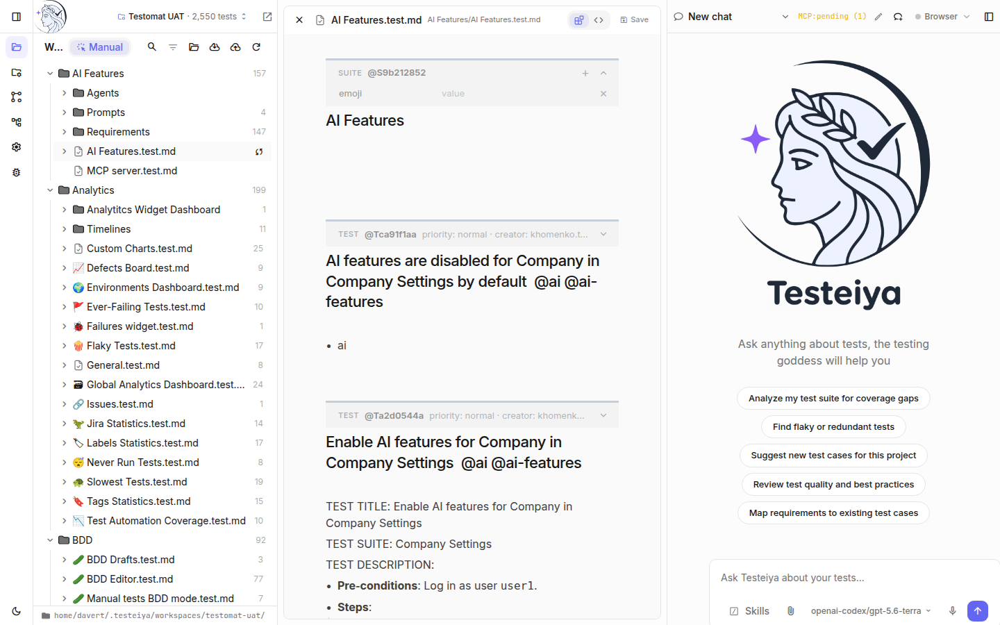
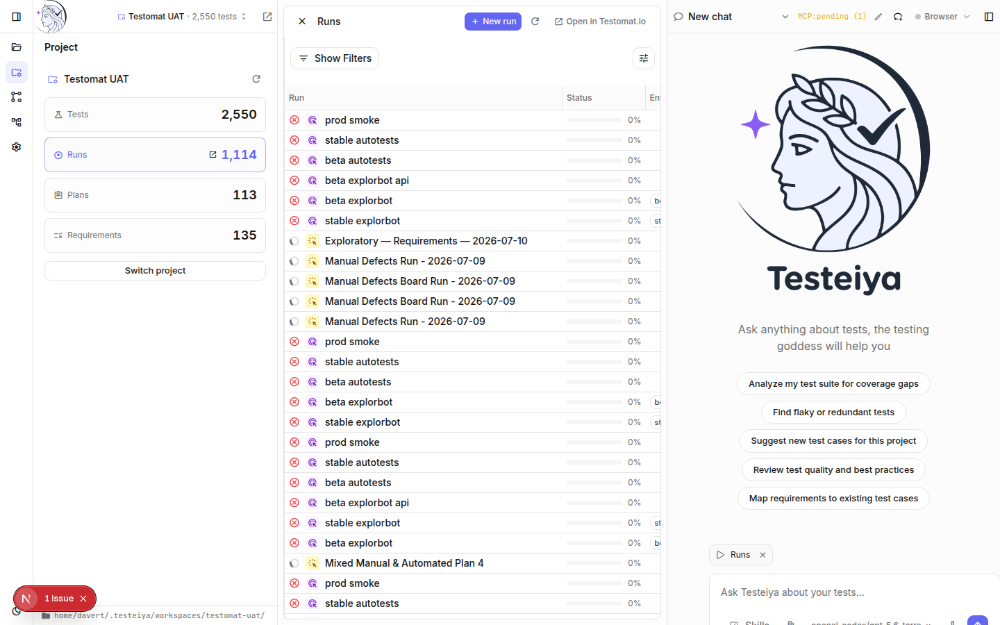

# Manual testing

Testeiya covers the whole manual-testing loop: turn requirements into test cases, keep them well-structured, execute them as runs, and report results — without leaving the app.

## Write test cases with the agent

Describe what you're testing and let the agent draft the cases:

> Generate test cases for the password reset flow. Cover expired links, reused links, and rate limiting.

The `qa-write-test-cases` skill produces cases in the Testomat.io markdown format — preconditions, steps, expected results — directly into your workspace's `*.test.md` files. Give it more to work with and it gets sharper:

- **Paste requirements** (a user story, a BRD, an API spec) or attach files with the paperclip.
- **Point at code** — in a repo workspace the agent reads the implementation and derives edge cases from it.
- **Analyze a pull request** — `pull-request-diff-analyzer` extracts acceptance criteria from a diff so new features get test cases before QA sees a build.

Before development even starts, run requirements through `qa-requirement-reviewer` (*"review these requirements before we build them"*) to surface ambiguity, contradictions, and testability gaps — or `qa-thinking` (*"what could go wrong with this feature?"*) for edge cases, negative flows, and abuse scenarios worth covering.

## Keep the suite healthy

- *"Find duplicate test cases"* — exact and near-duplicate detection with keep/merge/remove recommendations.
- *"Improve the test cases in Checkout.test.md"* — clarity, structure, and format compliance fixes.
- *"Which requirements have no test coverage?"* — the agent cross-references the project's requirements with the suite.

Review every change in the test editor, then **Push** to Testomat.io:

## Execute a manual run

You can run manual tests inside Testeiya:

1. Open **Runs** in the Project section and click **New run**.
2. Configure the run: title, manual or automated kind, the test source (a plan or the whole suite), and environment.
3. Step through the tests in the run widget: read each case, mark **passed / failed / skipped**, and leave comments.
4. Attach evidence as you go — upload files or **capture a screenshot of your screen** directly from the run widget.

Results report to Testomat.io live, so the run's progress is visible to the whole team as you test.

> [!TIP]
> Keep the run widget open while chatting. It's attached to your prompt as context, so *"write a bug report for the failing test"* refers to exactly what you're looking at.

### Semi-automated execution with the agent

Ask the agent to assist the run — *"help me pass this manual run"* (the `manual-run-assistant` skill). It opens the managed browser, navigates to the page each test starts on, and hands the window to you.

Press **Start test** on a test to launch its execution timer. With the browser open, Testeiya also starts capturing what happens while you test: console errors, failing requests, and a full Playwright trace. A live badge shows the counts as you go — click it anytime to have the agent look at the signals mid-test.

When you save a verdict:

- the timed duration is stored as the result's `run_time`;
- a browser screenshot is attached automatically (toggle **Auto-attach on save** in the screenshot menu);
- on a failure — or when errors were captured — the agent analyzes the evidence and, if it validates a real bug, proposes a note under the message field. **Add to message** appends it to your comment; it never overwrites what you typed.

The timer is yours to control: pause it, reset it, or click the time to type a corrected `mm:ss` value before saving.

## Exploratory testing

For testing beyond scripted cases, the bundled Explorbot skills plan and drive exploratory sessions — ask the agent to *"plan an exploratory testing session for the checkout flow"*. The agent can also use its managed browser (the **Browser** control in the header) to open your application and verify behavior itself.

## What's next

- [Test management](test-management.md) — sync everything back to Testomat.io.
- [Automated testing](automated-testing.md) — graduate stable manual cases to automation.
