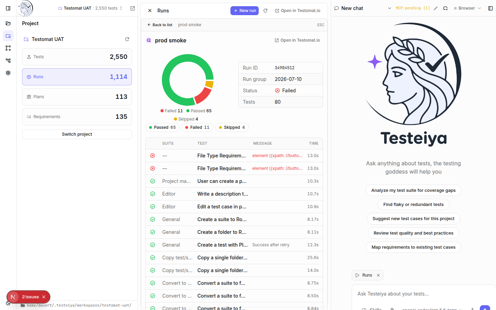

# Result analysis

When a run goes red, Testeiya turns "something failed" into "here is what broke, why, and what to do about it" — using live run data from the connected project.

## Browse runs

Open **Runs** in the Project section for the run history — status, progress, environment, and kind for every run:

Click a run for the detail view: a pass/fail/skip breakdown, run metadata, and every test result with its failure message and duration:

Filter results by status, drill into a single failing test, or jump to Testomat.io for the full artifacts.

## Ask the agent about failures

The real power is keeping a run open while you chat — the open widget is attached to your prompt as context:

> Why did this run fail? Group the failures by root cause.

Through the project MCP server the agent reads the run's raw results — error messages, stack traces, timings — and can:

- **Cluster failures** — separate one broken selector affecting ten tests from ten distinct bugs.
- **Spot patterns across runs** — the same test failing on every third run is flakiness, not regression; compare this run against the previous ones.
- **Distinguish product bugs from test bugs** — correlate failure messages with the test code and the application.
- **Draft defect reports** — turn a cluster into a ready-to-file bug report with reproduction steps.

For automated suites, follow up with *"fix it"* — the `debug-fix-failed-flaky-autotests` skill takes the analysis into your workspace code ([Automated testing](automated-testing.md)).

## Analyze trends across the suite

Beyond a single run, ask about the suite's history:

- *"Which tests are flaky?"* — tests that alternate between pass and fail across recent runs.
- *"What are our slowest tests?"* — duration outliers worth optimizing or splitting.
- *"Which tests have never run?"* — dead weight in the suite.
- *"Show me tests that fail in every run"* — ever-failing tests that mask new regressions.

The `testomatio-mcp` skill gives the agent query patterns for run analytics, failure investigation, and defect triage, so these questions get grounded answers from your project's actual data — not generic advice.

## What's next

- [Automated testing](automated-testing.md) — fix what the analysis found.
- [Test management](test-management.md) — prune and reorganize the suite based on what you learned.
