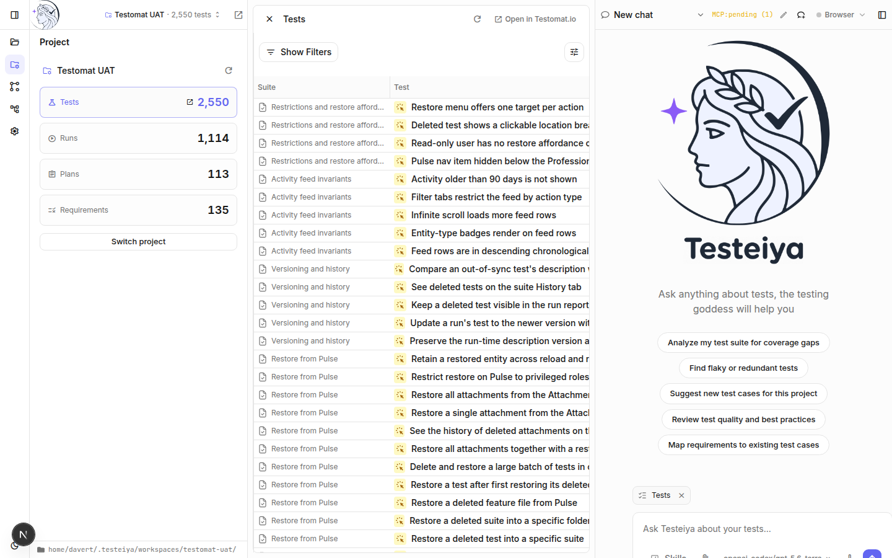

# Test management

Use Testeiya as a working surface for your Testomat.io projects: browse live project data, keep manual test cases in sync as files, and let the agent maintain them for you.

## Connect a project

1. Click **Connect Testomat.io** on the start screen (or **Switch project** in the Project section).
2. Authorize with your Testomat.io account and pick a project.

Opening a project creates a dedicated local workspace under `~/.testeiya/workspaces/<project>/`, pulls the project's manual tests into it as `*.test.md` files, and connects a project-scoped MCP server. Switching projects switches workspaces — each keeps its own files and chat sessions.

> [!NOTE]
> Working against a self-hosted or staging instance? Set the backend URL in **Settings → Testomat.io host**.

## Browse project data

The Project section shows live counts for Tests, Runs, Plans, and Requirements. Click a tile to browse that resource in a table with filters — no prompt needed:

Click a row to open the item, or **Open in Testomat.io** to jump to the web app. While a widget is open, it's attached to your next prompt as context — ask "which of these tests look redundant?" and the agent sees the same table you do.

## Test cases as files

A workspace represents a project's manual tests as markdown files — one `*.test.md` file per suite, in the Testomat.io markdown format. This is what makes the agent effective: it can read, search, diff, and edit test cases with ordinary file tools.

Two workspace shapes:

- **Managed project workspace** — created when you open a project; test files live at the root.
- **Your own folder** — open any directory. If it's a code repo, pulled test cases live in a gitignored `.testeiya/manual-tests/` overlay next to your code, so the agent can relate test cases to the source they cover.

Edit any test file in the built-in editor — a block editor that understands suites, test cases, IDs, priorities, and tags:

## Sync with Testomat.io

The Workspace section header has **Pull** and **Push** buttons:

- **Pull** refreshes local `*.test.md` files from Testomat.io.
- **Push** uploads your local edits — whether you made them by hand or the agent made them for you.

Sync runs [`check-tests`](https://github.com/testomatio/check-tests) under the hood, using the project token from your connected account. Test IDs (`@T...`/`@S...`) keep items matched across pulls and pushes, so nothing duplicates.

A typical loop:

1. **Pull** the latest test cases.
2. Ask the agent to reorganize a suite, retag tests, or fill gaps — it edits the files.
3. Review the changes in the editor (filter the tree to changed files).
4. **Push** back to Testomat.io.

## Let the agent manage tests

Test-management skills ship bundled — invoke them from the **Skills** menu or just describe the task:

- *"Find duplicate test cases in this suite"* — `detect-duplicate-test-cases` finds exact and semantic duplicates and recommends what to keep or merge.
- *"Improve these test cases"* — `improve-test-cases` fixes structure, clarity, and format compliance.
- *"Map requirements to existing test cases"* — coverage mapping against the project's requirements.
- *"Sync my tests"* — `sync-test-cases-with-tms` handles pull/push edge cases beyond the buttons.

## What's next

- [Manual testing](manual-testing.md) — generate new test cases and run them.
- [Result analysis](result-analysis.md) — work with runs and failures.
